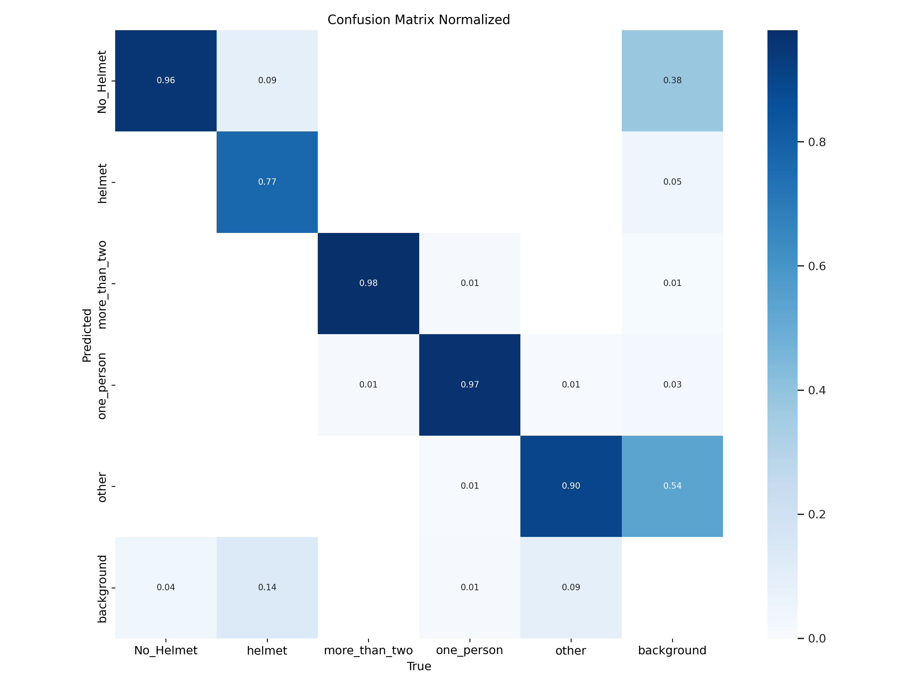
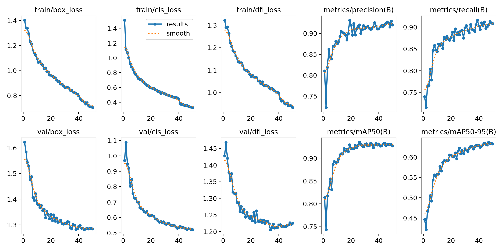

# Kickboard Safety Detection

전동킥보드의 헬멧 미착용과 2인 이상 탑승을 탐지하기 위해 데이터를 수집·라벨링하고 YOLOv8 객체 탐지 모델을 학습한 프로젝트입니다.

## 담당 작업

팀원 1명과 함께 킥보드 이미지를 수집하고, 수천 장 규모의 라벨링을 수행했습니다. 정리한 데이터셋으로 YOLO 모델을 학습했습니다. 라즈베리파이 애플리케이션 구현이나 실제 장치 배포는 제 담당 결과에 포함하지 않습니다.

## 실험 자료 구분

저장소에는 서로 다른 시기의 자료가 있습니다.

| 자료 | 범위 |
| --- | --- |
| [`data/data.yaml`](data/data.yaml), [`notebooks/kickboard.ipynb`](notebooks/kickboard.ipynb) | 복원된 초기 3클래스 실험: `more-than-two`, `person`, `scooter` |
| [`results/`](results/) | 포트폴리오에 사용한 후속 5클래스 실험의 보존된 시각화: `No_Helmet`, `helmet`, `more_than_two`, `one_person`, `other` |

포트폴리오의 5클래스 검증 지표를 초기 3클래스 설정으로 재현할 수는 없습니다. 후속 실험의 원본 데이터셋, 학습 로그 및 가중치는 현재 이 저장소에 없으며, 아래 그림은 보존된 결과 자료입니다.





## 저장소 구성

- [`notebooks/`](notebooks/): 복원된 학습 노트북
- [`scripts/train.py`](scripts/train.py): YOLO 학습 실행 예시
- [`scripts/predict.py`](scripts/predict.py): 로컬 추론 예시
- [`data/`](data/): 초기 3클래스 데이터 설정 예시
- [`deploy/raspberry_pi.md`](deploy/raspberry_pi.md): 라즈베리파이 배포를 위한 참고 가이드

`scripts/export_rpi.py`는 ONNX/TFLite 변환 예시입니다. 변환 스크립트와 배포 가이드가 있다는 사실을 실제 라즈베리파이 실행 완료로 해석해서는 안 됩니다.

## 초기 실험 실행 예시

```bash
pip install -r requirements.txt
python scripts/train.py --data data/data.yaml --model yolov8n.pt --epochs 50 --imgsz 640
```

`data/data.yaml`의 데이터 경로를 실제 로컬 데이터셋 위치에 맞게 수정해야 합니다. 공개 저장소에는 원본 이미지 데이터셋이 포함되어 있지 않습니다.
